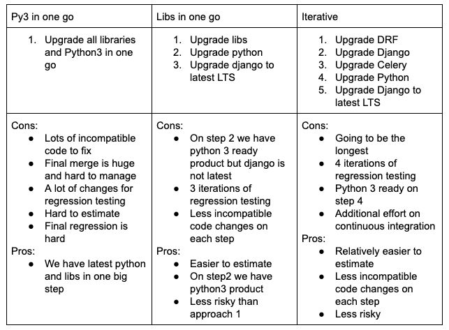

# ADR 0000: Approach of migration Olive3 to python3

## Status

- [x] active
- [ ] rejected
- [ ] deprecated
- [ ] superseded

## Context
In its current state Olive is using outdated libraries, outdated python version, is not ready for migration and this brings the some  risks which cann be devided into the following categories:
1. *Security*
   - A lot of third-party libraries used in Olive are outdated and not supported anymore. We cannot upgrade them to more recent and still supported versions since they dropped Python2 support (e.g. Django which is the core of Olive).
   - In case of 0-day or any other security issues found in third-party library we will not get an official update and will need to fix the ptoblem ourselves which increases the time to patch the security hole as well as requires additional resources to support the upgraded library ourselves.
2. *Olive stays alive in 2020*
   - Olive development may be slowed down or even blocked because of outdated third-party libraries and inability to introduce new third-party dependencies that dropped Python2 support, which may affect thing like:
     * New feature development
     * Bugfixing
     * New clients on-boarding

In order to mitigate outlined risks we've reviewed following potential solutions:
1. Rewrite Olive from scratch using latest python and libs. This would require a lot of product owners time and effort, lots of reverse engineering and time to get new specification ready for development. In addition it would require stopping of development of new features. This approach is good from technical standpoint but even after we get new Olive app ready we'll have to migrate existing users, teach support and BAU ot work with new app, implement infrastructure support from scratch, implement and execute roll-out of new app version and deprecate old one.
2. Split Olive to microservices architecture. Very similar situation here as with point 1. This would require PO time to understand how to split, where are the boundaries of contexts, and reverse engineering for outdated parts of codebase. This approach would also require adaptation other parts of infrastructure (frontend including legacy app, redis integration, etc) to new architecture, and significant changes in CI/CD pipelines.
3. Migration to python3. This approach is more or less generic (however hot easy anyway). Would not require feature freeze but backmarges new code into py3 branch.

With current resouces and situation in general, where both product teams are packed with new feature requests it makes more sense to proceed with python 3 migration. In terms of risks this approach is safest one.

## Decision
Migration procedure is not easy and can be executed in multiple ways. As a prerequisite for the migration there are few steps that need to be done in advance:
1. Migrate codebase to be py3 ready (run python-modernize on existing codebase)
2. Set up py3 linters so new code changes are compatible with python2 and python3
3. Set up and use black as default code formatter for our codebase

As the next steps we need to choose one of the following scenarios:

First approach is more suitable when we have feature freeze and teams working on upgrade collectively.

Second approach is less risky and can go side by side with feature development. Also work on each step can be paralelized between multiple people.

Third approach is less risky and includes gradual releases and integration of py2 developmen branch into py3 branch. It's more suitable for longer term development and with less resources.

We need to upgrade Olive to python 3. This will allows us to mitigate the mentioned risks and keep our product running and stay alive.

The approach that we choose is going to depend on business requirements.

Approach 2 is recommended in case we can allocate more resources (4-5 BE engs) to this work.
Approach 3 is recommended in case of less resources (1-2 BE engs).

## Consequences
We need to find resources for this migration.
We need to migrate codebase of big legacy product with as low impact to production as possible.
We want to do the migration without feature development freeze.

Cost of not doing:
* in case of unexpected security or downtime issue cost of 1 day of Olive downtime if very high (more than $XXX USD).
