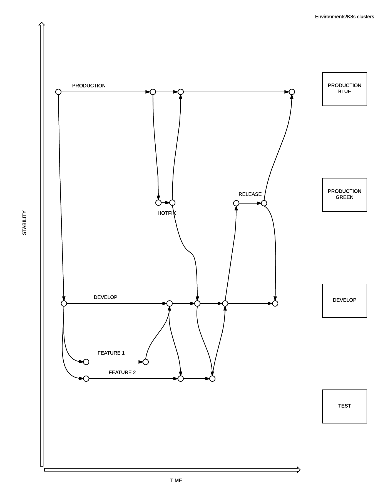
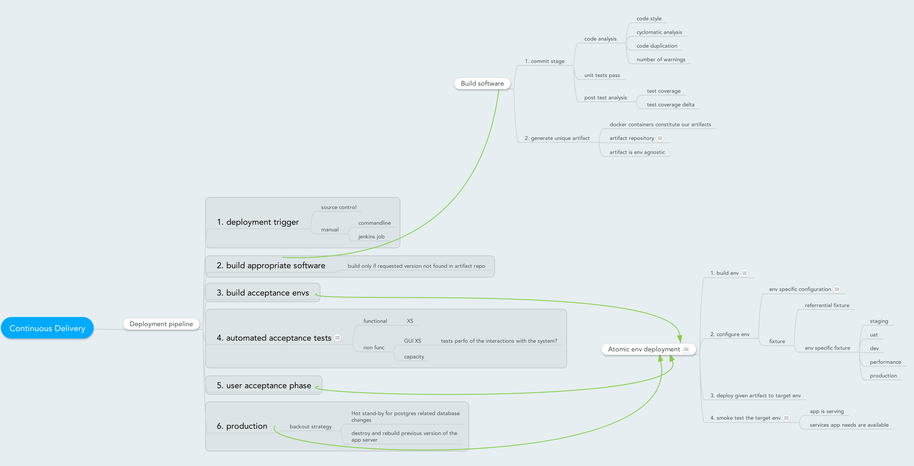
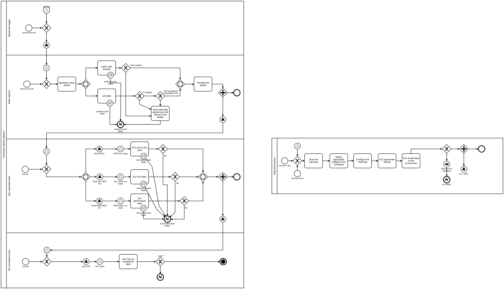
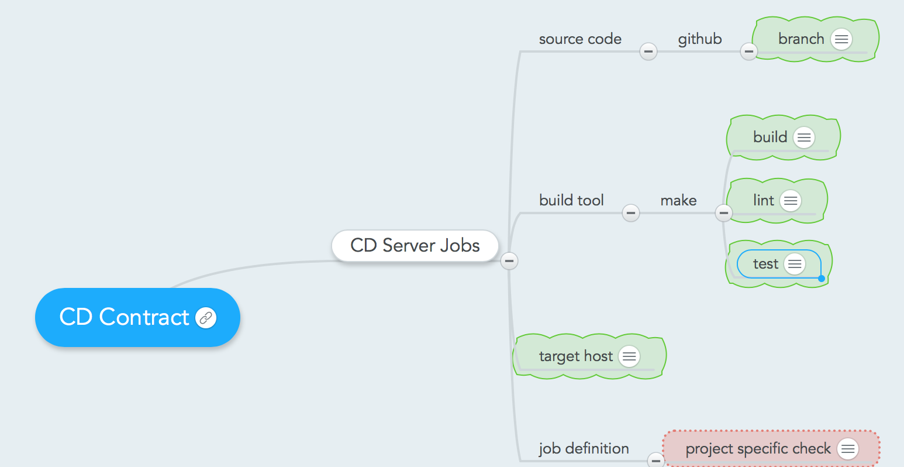

# Guidelines for software projects by 2Sixty

We keep our technology and process standards here. You can suggest changes by making a pull request.

## Table of content
- [Code repository](#code_repository)
- [Code review](#code_review)
- [Continuous Delivery](#continuous_delivery)
- [DoR and DoD](#dor_and_dod)

## Code repository <a name="code_repository"></a>

### Workflow



We have two stable branches:
`develop` - used for integration of the features before the release. This is always in a 'releasable' state. Any merge into this branch is propagated to the 'DEVELOP' cluster via Jenkins jobs.
`production` - mimics what is deployed to the production cluster; used as a base for hotfixes

Feature branches are used to work on features within a sprint. A sprint ends up with a creation of the release branch, which is automatically deployed to a production candidate (blue or green, depends on which one is considered to be active at the point of release. Manual tests and the user acceptance (UAT) is executed on this environment.

Any changes to the more stable branches are immediately propagated to the less stable branches via rebase or merge.

Any code merge from less to more stable branch kicks off a full Jenkins test suite according to the Continuous Delivery design.

We basicall use [Feature-branch-workflow](https://www.atlassian.com/git/tutorials/comparing-workflows#feature-branch-workflow) with [Interactive Rebasing](https://www.atlassian.com/git/tutorials/merging-vs-rebasing#the-golden-rule-of-rebasing) and some elements of [Gitflow](https://www.atlassian.com/git/tutorials/comparing-workflows#gitflow-workflow) (naming and having a develop branch).

The main steps are as follow:

* Checkout a new feature/bug-fix branch
    ```
    git checkout -b <branchname>
    ```
* Make Changes
    ```
    git add
    git commit -m "description of changes"
    ```
* Sync with remote to get changes you’ve missed
    ```
    git checkout develop
    git pull
    ```
* Update your feature branch with latest changes from develop by interactive rebase ([Here is why](https://www.atlassian.com/git/tutorials/merging-vs-rebasing#the-golden-rule-of-rebasing))
    ```
    git checkout <branchname>
    git -i rebase develop
    ```
* If you don’t have conflict skip this step. If you have conflicts, [resolve them](https://help.github.com/articles/resolving-a-merge-conflict-using-the-command-line/)  and continue rebase
    ```
	git add <file1> <file2> ...
    git rebase --continue
    ```
* Push your branch. Rebase will change history, so you'll have to use `-f` to force changes into the remote branch. If someone else is working on your branch, use the less destructive `--force-with-lease` ([Here is why](https://developer.atlassian.com/blog/2015/04/force-with-lease/)).
    ```
    git push -f
    ```
* Make a Pull Request
* Choose a reviewer
* Pull request will be accepted, merged and close by reviewer; Reviewer will also delete your feature branch from the repo after merge
* Remove your local feature branch if you're done
* Once the changes are ready for release, spin up a short-living release branch and do the manual tests there


### Some Git Rules
There are a set of rules to keep in mind:
* Perform work in a feature branch.
* Make a pull requests to `develop`
* Never push into `develop` or `production` branch.
* Update your `develop` and do a interactive rebase before pushing your feature and making a PR
* Resolve potential conflicts while rebasing and before making a Pull Request
* Delete local and remote feature branches after merging.
* Before making a PR, make sure your feature branch builds successfully and passes all tests (including code style checks).
* Use .gitignore file appropriate for your project.
* Make sure that you put all the ignoring rules that pertain to your local setup in your local gitignore file (How to in [Github](https://help.github.com/articles/ignoring-files/#create-a-global-gitignore))
* Protect your `develop` and `production` branch (How to in [Github](https://help.github.com/articles/about-protected-branches/)).


### Writing good commit messages

Having a good guideline for creating commits and sticking to it makes working with Git and collaborating with others a lot easier. Here are some rules of thumb ([source](https://chris.beams.io/posts/git-commit/#seven-rules)):

 * Separate the subject from the body with a blank line
 * Limit the subject line to 50 characters
 * Capitalize the subject line
 * Do not end the subject line with a period
 * Use the imperative mood in the subject line
 * Wrap the body at 72 characters
 * Use the body to explain what and why vs. how

## Code review <a name="code_review"></a>

### Why do we do code review?
* Make sure the code follows stylistic guidelines
* Make sure the code is written in a readable way
* Make sure the code is tested thoroughly
* Make sure that the solution follows the agreed architectural tenets
* Make sure that the solution follows the agreed interfaces and APIs
### Rules

#### Pair programming
Teams are encouraged to write code while pair programming. This is the cheapest way of code review. Any code written like that will go automatically through the review gate. Tech Leads are responsible for approval of the pair programmed Pull Requests.

Rationale: Catching problems early is the cheapest way of avoiding bugs. Nothing is faster than the pair programming exercise.

#### Preconditions for Code Review
Code Review can only be executed if the automatic checks on a PR are succesful:
* Static code analysis succeeds (PEP8 and McCabe)
* Unit tests are passing
* Test coverage is acceptable
* Code has self-documenting capabilities
* Code can be merged to the baseline (no need to rebase)
Rationale: Automatic checks remove necessity for human review. They are faster and more reliable. Humans should check that rules are being followed. Machines should enforce the compliannce with rules.

#### Ownership and initial response time
The Author chooses an Assignee (or two) to carry out the Code Review. The Assignee must response to the Code Review request within 4 working hours.

Rationale: It is our intention to minimise the blockage between different work streams. Any pending code review blocks work and incurs a penalty due to necessity of rebase on trunk change.

#### Rejection
The Assignee may reject the request for the Code Review if he/she already has some other Code Reviews open.
The Assignee may reject the request for CR if its size is too big. Big CRs must be agreed with the Assignee and tracked through the Kanban process.

Rationale: Assignees need a mechanism to reject unreasonable requests

#### Comments and reaction
The Author must response to comments within 4 working hours. Each comment must be responded to so that the Assignee knows that His/Her comments were understood.

Rationale: Removal of blockage. Respect for time invested by the Assignee.

#### Issues and disagreements
Any disagreements around the Code Reviews should be solved by:
Author and Assignee face to face communication
Team discussion
Tech Lead
On rare occasions this can be escalated further

Rationale: We need a clear escalation path.

#### Merge
The code is merged by the Author only when all the precondition have been met and all the comments have been reacted to. Assignees confirm their agreement to merge by leaving appropriate comment as a general comment on the PR.

Rationale: Authors have interest in getting their work accepted.

#### Code review lifespan
Code reviews cannot live longer than a week.

Rationale: We are aiming for the Continuous Integration paradigm. Limits for CR life encourages small sizes of the pull requests and allow for daily trunk integration.

#### Metrics
Teams code review effectiveness will be measured (PRs marked as WIP will be excluded):
* Average lifespan of PRs
* Average number of comments/fixes
* Average age of PR

Rationale: We need to start measuring our main development processes in order to identify which bits need attention and change

## Continuous Delivery <a name="continuous_delivery"></a>

It is our intention to implement a deployment pipeline based on the idea of Continuous Delivery. Each step of this pipeline represents an upgrade in confidence that a piece of software is stable enough to be pushed along up to the production system.



The 'build software' step build an artefact (docker image) which is stored in a repository of artefacts. It represent a stabilised version of a piece of software. The remaining steps of the pipeline reuse the artefact without rebuilding it. It ensures that what is tested is actually what is deployed.

The process is designed in more depth using BPMN. It can be visualised as: 




### CD contract

In order to assure easy integration between the Infrastructure Engineering and Development, we must follow a set of rules which describe what the developers will be delivering for the infrastructure engineers to set up the CD pipeline.



#### Code

The specific branch to be tested. 

#### make
Build tool communicates its success or failure with the job via exit code.
It is responsibility of developer team to set and maintain success criteria for each target.

Targets include:
* build - Build the artefact to be used. Currently the artefact expected is docker image of the application.
* lint - Lint source code to make sure source code meets expected quality.
* test - Execute unit tests required to make sure that the artefact is acceptable. Calculate code coverage and store code coverage report to be consumed later by CD Sever.

#### Target host
The host to which built artefact is deployed in case the job succeeds. If not provided, this is Jenkins slave.

#### Job definition
Job definition is in the ownership of DevOps, however there're cases when there're project specific checks that needs to be addressed, i.e. branch name check. Theses specific things needs to be implemented by DevOps team.

## Definition of Ready, and Definition of Done <a name="dor_and_dod"></a>

### DoR

Each team is responsible for agreeing upon and enforcing a DoR. The positions in bold are imperative. Team Lead is the guardian of the DoR and makes sure that the team is protected from accepting work that does not fit the expected DoR.

* __eXecutable specification has been agreed, published on a branch in an XS repository and provided within a context of an appropriate mind map__
* Stories have been written up and entered on an appropriate task management board. The stories link to appropriate changes of the XS. The stories are written using INVEST methodology.
* User Experience has been executed and requirements have been gathered in form of wireframes, prototypes and screenshots
* Non-functional performance metrics have been agreed and specified clearly using XS
* The work has been estimated by the team and the team has agreed that it will fit into a single iteration of work
* Architectural changes have been documented in an appropriate way (entity diagrams, sequence diagrams, workflows)
* Demo scope and format has been agreed
* Release plan has been updated and the Release Manager has entered it into the planning document


### DoD

The Definition of Done (DoD) describes the minimum requirements that are __needed before a piece of work can be considered done__.

Each team is responsible for delivering work that conforms to the DoD. The positions in bold are imperative. Product Owner is the guardian of the DoD and makes sure that the product team is protected from accepting work that does not fit the DoD.

* __Automated XS testing has been implemented and is passing__
* The code meets the engineering standards
* The unit tests are passing
* Test coverage is maintained or increased
* The code has passed the Peer Review
* The code is ready to be merged to trunk
* We know how to Demo the results of work
* Swagger definition of touched/changed/created APIs is published into the API repository

All the points of the DoD except for the last one can and should be built into our CD process.
